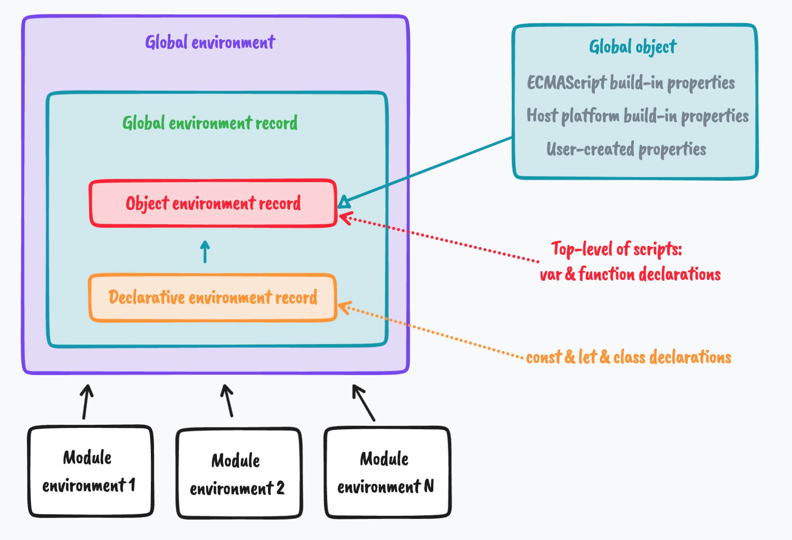

目录：
[[toc]]


本章将详细的看一看JS全局变量是如何工作的。几个有趣的现象扮演着重要的角色：脚本作用域，所谓的 *全局对象（`global object`）* 以及其它。


<p id="1"></p>


## 1️⃣ 作用域

📚一个变量的词法作用域（`lexical scope`, 简称 `scope`） 是一个程序能访问到的区域。JS作用域是*静态的*（在运行时不会改变），并且作用域可以进行嵌套：🌰

```js {1,4}
function func() { // A
  const aVariable = 1
  
  if (true) {     // B
    const anotherVariable = 2
  }
}
```

`if` 语句（B行）产生的作用域嵌套在函数 `func()` (A行) 中。

包裹在 `S` 作用域称外的作用域称之为S的 **外部作用域（`outer scope`）**，上例中 `func` 便是 `if` 的外部作用域。


<p id="2"></p>


## 2️⃣ 词法环境

在JS语言规范中，作用域通过 *词法环境（`lexical environments`）* 实现。由2个组件组成：

- 一个 *环境记录（`environment record`）* 将变量名映射到变量值（可理解为字典）。这是该作用域中存储变量的实际存储空间。记录中的 `name-value` 条目（`entries`）称之为 *绑定（`bindings`）*
- 一个 *外部环境（`outer environment`）* 的引用：外部作用域的环境

::: tip
👩🏻‍🏫 因此，嵌套作用域树通过外部环境引用的环境树表示（The tree of nested scopes is therefore represented by a tree of environments linked by outer environment references）。
:::


<p id="3"></p>


## 3️⃣ 全局对象

全局对象是指其属性变为全局变量的对象（我们将稍后检查它如何准确地适合环境树。）。它可以通过以下全局变量被访问：

- 所有平台都能访问： [globalThis](https://exploringjs.com/impatient-js/ch_variables-assignment.html#globalThis)。这个名字的由来基于它和全局作用于下的 `this` 拥有相同的值的事实。
- 其它全局对象不是所有平台都存在：
  - `window` 是引用全局对象的经典方式。它在浏览器代码中运行正常，但是不支持 *Web Workers（和浏览器进程并行运行的进程）* 和 Node.js
  - `self` 在浏览器环境（包括Web Workers）中都可以访问，但不支持Node.js
  - `global` 只存在于Node.js 中


<p id="4"></p>


## 4️⃣ 在浏览器中，globalThis 不直接指向全局对象

在浏览器中，`globalThis` 不直接指向全局对象，存在一个间接性。示例，想象一下web页面中的 `iframe`:

- 当iframe的 `src` 发生变化时，它将获取一个全新的全局对象
- 然而，`globalThis` 总是相同的值。该值可在iframe外部进行检验，示例如下（示例灵感来源于 [an example in the globalThis proosal](https://github.com/tc39/proposal-global#html-and-the-windowproxy)）

`parent.html`文件：

```html {4,8,16,20,21}
<iframe src="iframe.html?first"></iframe>
<scirpt>
  const iframe = document.querySelector('iframe')
  const icw = iframe.contentWindow // iframe的 'globalThis'
  
  iframe.onload = () => {
  // 访问iframe全局对象上的属性
    const firstGlobalThis = icw.globalThis
    const firstArray = icw.Array  // 全局对象 Array
    console.log(icw.iframeName) // 'first'
  
    iframe.onload = () => {
      const secondGlobalThis = icw.globalThis
      const secondArray = icw.Array
  
      // 全局对象是不同的
      console.log(icw.iframeName) // 'second'
      console.log(secondArray === firstArray) // false
      
      // 但是 globalThis 仍一样
      console.log(firstGlobalThis === secondGlobalThis) // true 🤩
    }

    // 改变iframe src
    iframe.src = 'iframe.html?second'
  }
</scirpt>
```

`iframe.html` 文件：

```html
<script>
  globalThis.iframeName = location.search.slice(1)
</script>
```

👩🏻‍🏫 浏览器是如何确保 `globalThis` 这种情况下仍不改变的呢？浏览器内部对这2个对象进行了区分：

- [Window](https://html.spec.whatwg.org/multipage/window-object.html#the-window-object) 是全局对象，**当location发生变化时，它也跟着发生变化 📚**（译者注：这也是为什么微前端中调用window.reload()是最硬核的隔离的原因）
- [WindowProxy](https://html.spec.whatwg.org/multipage/window-object.html#the-windowproxy-exotic-object) 是将所有访问转发到当前 `Window` 的一个对象。**这个对象永远不会改变 😎**

::: tip
📚 在**浏览器**中，`globalThis` 指向 `WindowProxy`；则其余环境中，它直接指向全局对象。
:::


<p id="5"></p>


## 5️⃣ 全局环境

全局作用域是最外层（`outermost`）的作用域 - 它上面没有外层作用域了。它的环境是 *全局环境（`global environment`）*。每个环境都通过由外部环境引用链接的环境链与全局环境连接，全局环境的外部环境引用是 `null`。（译者注：类似原型链的机制）

💡全局环境记录使用2个环境记录管理其变量：

1. 一个 *对象环境记录（`object environment record`）*,它和普通环境记录使用相同的接口，但是将其*绑定（`bindings`）* 保存在JS对象中。这种情况下，该对象为全局对象。
2. 一个 *普通（声明式）环境记录（`normal (declarative) environment`）* 拥有自己存储绑定的空间 😎

这两个记录中的哪一个在什么时候使用，稍后会解释。


<p id="5.1"></p>


### 5.1 脚本作用域和模块作用域

在JS中，只有最上层的脚本（`scripts`） 在全局作用域中。相比之下，每个模块都拥有自己的作用域，它们是脚本作用域的子作用域。

如果我们忽略变量绑定如何添加到全局环境的复杂规则，全局作用域和模块作用域工作原理就好像下面嵌套代码块一样：

```js
{ // 全局作用域 （所有脚本的作用域）
  
  // （全局变量）
  { // 模块1作用域
    ...
  }
  
  { // 模块2作用域
    ...
  }
  // (更多模块作用域)
}
```


<p id="5.2"></p>


### 5.2 创建变量：声明式记录 vs. 对象记录

📚 为了创建一个真正的全局变量，我们必须在全局作用域中：即在最上层的脚本（`scirpts`）中:

- 顶层 `const & let` & `class` 在声明式环境记录（`declarative environment record`）中创建绑定
- 顶层 `var` & `function`声明 在对象环境记录中创建绑定

```html {2,3,6,10}
<script>
  const one = 1 // 声明式环境记录中创建绑定
  var two = 2 // 对象环境记录中创建绑定
</script>
<script>
  // 所有脚本共享相同的最上层作用域
  console.log(one) // 1
  console.log(two) // 2
  
  // 并非所有声明都创建全局对象的属性 🤔
  console.log(globalThis.one) // undefined
  console.log(globalThis.two) // 2
</script>
```


<p id="5.3"></p>


### 5.3 获取或设置变量

当我们获取或者设置一个变量，2个环境记录中都存在该变量的绑定时，声明式记录获胜😎：

```html {5}
<script>
  let myGlobalVariable = 1 // 声明式环境记录
  global.myGlobalVaribale = 2 // 对象环境记录
  
  console.log(myGlobalVariable) // 1 (声明式环境记录获胜 ✌️)
  console.log(globalThis.myGlobalVariable) // 2 (从对象环境记录中获取)
</script>
```


<p id="5.4"></p>


### 5.4 全局ECMAScript变量 和 全局宿主变量

除了通过 `var` 或者 函数声明 创建的变量外，全局变量包含以下属性：

- ECMAScript所有内置的全局变量（比如 `Math`）
- 所有宿主平台（浏览器，Node.js等等）内置全局变量（比如 `global` | `window`）

使用 `const | let` 可确保全局变量声明不受内置的ECMAScript & 宿主全局变量影响或者影响到内置的ECMAScript & 宿主全局变量。

比如：浏览器有一个 [location](https://developer.mozilla.org/en-US/docs/Web/API/Window/location) 全局变量：

```js
// 将改变当前document的location（直接跳转到该地址）
var location = 'https://example.com'

// 屏蔽 window.location, 但是不会改变它
let location = 'https://example.com'
```

如果一个变量已经存在（比如这里的 `location`）, 则带有初始化器的`var` 声明表现得就像是赋值。这也是为什么我们这个例子会遇到麻烦。

::: warning
👩🏻‍🏫 注意这只会在全局作用域中会存在问题。在模块中，我们永远不会在全局作用域中（除非使用类似 `eval()` 方法）。
:::


总结目前所学到的：




1. 全局作用域的环境通过一个 **全局环境记录（`Global environment record`）** 管理其绑定
2. 而 *全局环境记录* 又由2个环境记录组成：
   1. *对象环境记录（`Object environment record`）* 将绑定存储在全局对象（`Global object`）上
   2. *声明式环境记录（`Declarative environment record`）* 使用自己内部存储记录其绑定
3. 因此，全局变量可以通过向全局对象添加属性或者通过各种声明（`var` | 函数声明）进行创建
4. 全局对象的初始化包含ECMAScript全局变量和宿主平台提供的全局变量
5. 每个ECMAScript模块（即 `ESM`）都拥有自己独立的环境，模块的外部环境是全局环境


<p id="6"></p>


## 6️⃣ 总结：为什么JS同时拥有普通全局变量和全局对象？

全局对象通常被认为是一种错误。基于此，新的构建，比如 `const | let | classes` 创建普通全局变量（在脚本作用域时）。

幸运的是，大多数现代JS都写在 [ESM 和 CJS 模块中](https://exploringjs.com/impatient-js/ch_modules.html)。每个模块都拥有自己独立的作用域，这也是为什么统治全局变量的规则在基于模块的代码中，就显得不那么重要了。


<p id="7"></p>


## 7️⃣ 进一步阅读和本章来源

ECMAScript规范中的环境和全局对象：

- [Section "Lexical Environments"](https://tc39.es/ecma262/#sec-lexical-environments) 提供对环境的概览
- [Section "Global Environment Records"](https://tc39.es/ecma262/#sec-global-environment-records) 介绍了全局环境
- [Section "ECMAScript Standard Built-in Objects"](https://tc39.es/ecma262/#sec-ecmascript-standard-built-in-objects) 描述ECMAScript如何管理其内置对象的（包括全局对象）

`globalThis`:

- [ES feature: globalThis](https://2ality.com/2019/08/global-this.html) 2ality文章
- [Ahorrifying globalThis polyfill in universal JavaScript](https://mathiasbynens.be/notes/globalthis) 各种访问全局 `this` 的方式

浏览器中的全局对象：

- [Defining the WindowProxy, Window and Location objects](https://blog.whatwg.org/windowproxy-window-and-location) 浏览器发生了什么
- [section "Realm, settings objects and global objects"](https://html.spec.whatwg.org/multipage/webappapis.html#realms-settings-objects-global-objects) WHATWG HTML标准（非常技术性）
- 在ECMAScript 规范中，我们可以看到浏览器如何自定义全局this的 [section "InitializeHostDefinedRealm()"](https://tc39.es/ecma262/#sec-initializehostdefinedrealm)


原文链接：

- [5 A Detailed look at global variables](https://exploringjs.com/deep-js/ch_global-scope.html)

2022年07月04日16:22:00